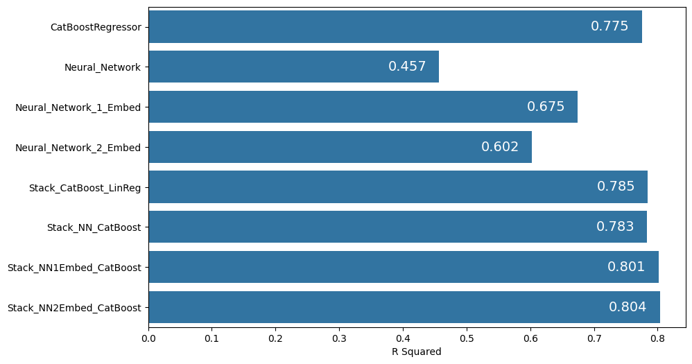
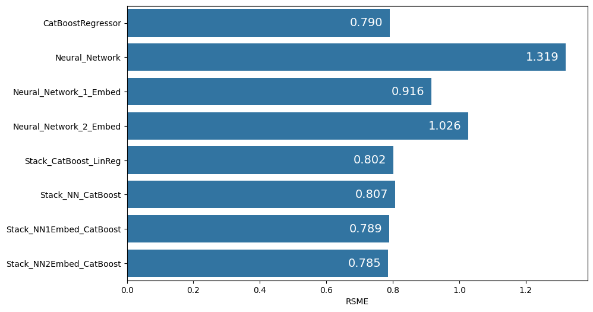

# Prediction of bioprocess yield, titer and rate

Predicting microbial bioproduction (yield, titer and rate) from bioprocess variables and genetic modifications.

[Reference: Machine learning framework for assessment of microbial factory performance] (https://journals.plos.org/plosone/article?id=10.1371/journal.pone.0210558)

[Original Dataset] (https://doi.org/10.1371/journal.pone.0210558.s001)

Several techniques (log transformation, scaling, onehot encoding, embedding) were employed to handle the mixture of data types. Of note, representation of the categorical features and the list of genes through embeddings helped model performance. A variety of models, including those handling hyperparameter tuning e.g. BayesSearchCV, H2O AutoML and keras_tuner, was used. Similar to the reference, ensemble models, particularly ensemble of neural network with CatBoostRegressor, performed the best in terms of R2 values. Despite the lack of COBRA features (from metabolic models), overall R2 reached around 0.8 through careful feature engineering and selection of models. 

# Installation

1. Clone repository

git clone https://github.com/ltchuan1983/bioproduction.git

2. Install dependencies

pip install -r requirements.txt

# Usage

## Model fitting

main.py can be run with various options to train the provided datasets with different models as below.

python3 main.py <option>

<option>
1. train ---> CatBoostRegressor

2. train_multi ---> Battery of regressors (CatBoostRegressor,RandomForestRegressor, AdaBoostRegressor, XGBRegressor, LinearRegression, ElasticNet, Support Vector Machines): python3 main.py train_multi

3. train_gridsearch ---> GridSearchCV with CatBoostRegressor

4. train_bayes ---> BayesSearchCV with CatBoostRegressor

5. train_nn ---> Dense neural networks with Dropout and BatchNormalization layers

6. train_embed_nn ---> Dense neural networks with Dropout and BatchNormalization layers PLUS one embedding layer to handle onehot encoded categorical features

7. train_embed_genotype_nn ----> Dense neural networks with Dropout and BatchNormalization layers PLUS one embedding layer to handle onehot encoded categorical features AND one embedding layer to handle genotypes listed in "strain_background_genotype"

8. train_tunable_nn ---> keras_tuner to tune networks used in train_nn

9. train_automl ---> H2O AutoML for automated ML spanning a variety of models

10. train_stack ---> Stack ensemble (using StackingRegressor) where base estimator = CatBoostRegressor and meta estimator = LinearRegression

11. train_stack_nn1embed_catboost ---> Stack ensemble where base estimator = neural network with 1 embedding layer for categorical features (i.e. train_embed_nn) and meta estimator = CatBoostRegressor

12. train_stack_nn2embed_catboost ---> Stack ensemble where base estimator = neural network with 2 embedding layers, one for categorical features and another for genotypes (i.e. train_embed_genotype_nn) and meta estimator = CatBoostRegressor

## Prediction

main.py can also be run with <predict> to generate predictions on dataset contained in sqlite3 table <table_name>

python3 main.py predict --table <table_name>

Default data for generating predictions is found in the table <test_data> (which includes a feature containing genotypes tokenized to integers). To make predictions on this dataset, run:

python3 main.py predict --table test_data

New dataset can be saved in similar tables and be used to make predictions given that the dataset contains the same features. 

# Available tables in data.sqlite

cleaned_table ---> Data derived from original source after imputation and cleaning

cleaned_table_2 ---> Same as cleaned_table but in addition, contain strain_background_genotype as embeddings (aggregated via averaging)

cleaned_table_3 ---> Same as cleaned_table but in addition, contain strain_background_genotype as embedding (aggregated via appending)

cleaned_table_4 ---> Same as cleaned_table but in addition, contain strain_background_genotype as integer tokens

train_data ---> Train data derived from one of the tables above after train_test_split

test_data ---> Test data derived from one of the tables above after train_test_split

# Data cleaning and preprocessing

1. Data rows where 'titer' > 16, 'yield' > 1.2 and 'rate' > 2 are removed.
2. Missing values in the features are filled mostly by inspection, relationships with related features and re-examination of the publications where the data is sourced from.
3. Missing values in the targets are filled by correlation among yield and titer OR titer = rate * fermentation value
4. Features containing list of numbers corresponding to genotypes or genes are summed to convert lists into aggregated values
5. List of strings representing genotypes are converted to either embeddings via word2vec or tokenized for input into embedding layers in neural networks

# Model Performance

Stacked ensemble comprising of neural network (2 embeding layers) and CatBoostRegressor performed best for R2 and RMSE. However, considering training and prediction efficiency, CatBoostRegressor itself is a good option

